# Block Management

Architecture diagram, block reference, and SQL tracking schema for the Kamatas PROD workflow.

**Workflow:** `98c363ef-febc-42cc-82d2-d40b501c5b56`
**Workspace:** `ac7ec7a6-f09a-4035-8e96-e9e95b75221b`
**Block Count:** 25 (all enabled)

---

## Table of Contents

1. [Architecture Diagram](#architecture-diagram)
2. [Block Quick Reference](#block-quick-reference)
3. [Edge Map](#edge-map)
4. [Condition Handle Reference](#condition-handle-reference)
5. [SQL Tracking Schema](#sql-tracking-schema)

---

## Architecture Diagram

```mermaid
flowchart TD
    webhook["webhook\n(generic_webhook)"]
    routeByType{"routeByType\n(condition)"}
    budgetCheck["budgetCheck\n(postgresql)"]
    budgetGate{"budgetGate\n(condition)"}
    budgetHandoff["budgetHandoff\n(function)"]
    buildCompositeKey["buildCompositeKey\n(function)"]
    fetchCustomerInfo["fetchCustomerInformation\n(function)"]
    storeUserMsg["storeUserMessage\n(memory)"]
    setLatest["setLatestMessageId\n(upstash)"]
    debounce["debounceWait\n(wait)"]
    getLatest1["getLatestMessageId\n(upstash)"]
    checkLatest1{"checkIfTheMessageLatest\n(condition)"}
    isMedia{"isMediaMessage\n(condition)"}
    mediaHandoff["mediaHandoff\n(function)"]

    webhook --> routeByType
    routeByType -->|"IF text\ncondition-9dd96cb8-...-if"| budgetCheck
    routeByType -->|"ELSE\ncondition-9dd96cb8-...-else"| isMedia

    budgetCheck --> budgetGate
    budgetGate -->|"IF allowed\ncondition-budget-gate-if"| buildCompositeKey
    budgetGate -->|"ELSE exceeded\ncondition-budget-gate-else"| budgetHandoff

    buildCompositeKey --> fetchCustomerInfo
    buildCompositeKey --> storeUserMsg
    storeUserMsg --> setLatest --> debounce --> getLatest1 --> checkLatest1

    isMedia -->|"IF media\ncondition-block-9f9c16f6-...-if"| mediaHandoff

    subgraph agentLoop["agentLoop (loop)"]
        supportAgent["supportAgent\n(agent)"]
        agentVariable["agentVariable\n(variables)"]
        errorWait["errorWait\n(wait)"]
        supportAgent -->|"success"| agentVariable
        supportAgent -->|"error"| errorWait
    end

    fetchCustomerInfo --> agentLoop
    checkLatest1 -->|"IF latest\ncondition-6c9c86c3-...-if"| agentLoop

    getLatest2["getLatestMessageId2\n(upstash)"]
    checkLatest2{"checkIfTheMessageLatest2\n(condition)"}
    extractSearch["extractSearchContext\n(function)"]
    hasIkas{"hasIkasContext\n(condition)"}
    storeIkas["storeIkasContext\n(memory)"]
    convHistory["conversationHistory\n(memory)"]
    sendChatwoot["sendToChatwoot\n(function)"]

    agentLoop -->|"loop-end"| getLatest2
    getLatest2 --> checkLatest2
    checkLatest2 -->|"IF latest\ncondition-35e2d3f8-...-if"| extractSearch
    extractSearch --> hasIkas
    hasIkas -->|"IF has context\ncondition-has-context-if"| storeIkas
    hasIkas -->|"ELSE\ncondition-has-context-else"| convHistory
    storeIkas --> convHistory
    convHistory --> sendChatwoot
```



### Flow Summary

| Path | Route | Description |
|------|-------|-------------|
| **Text (normal)** | webhook → routeByType → budgetCheck → budgetGate (IF) → buildCompositeKey → [fetchCustomerInfo, storeUserMessage] → debounce pipeline → agentLoop → post-processing → sendToChatwoot | Standard incoming text message |
| **Budget exceeded** | webhook → routeByType → budgetCheck → budgetGate (ELSE) → budgetHandoff | Quota hit, escalate to human |
| **Media** | webhook → routeByType (ELSE) → isMediaMessage (IF) → mediaHandoff | Image/audio/video handoff |
| **Dropped** | webhook → routeByType (ELSE) → isMediaMessage (ELSE) | Outgoing/activity/document — silently dropped |

---

## Block Quick Reference

All 25 blocks in the live Kamatas PROD workflow. All are currently **enabled**.

| # | Display Name | Block ID | Type | Path |
|---|-------------|----------|------|------|
| 1 | webhook | `51aa80c7-1069-42d6-8388-f0cc5752b3eb` | generic_webhook | Entry |
| 2 | routeByType | `5023fc47-0d49-4537-a52b-56a77dc8a806` | condition | Router |
| 3 | budgetCheck | `3b8fdfa3-2b40-4894-b152-49cdac832312` | postgresql | Budget |
| 4 | budgetGate | `budget-gate-block` | condition | Budget |
| 5 | budgetHandoff | `budget-handoff-block` | function | Budget |
| 6 | buildCompositeKey | `671c26a9-6a32-4a13-ae39-0b6b8c812548` | function | Text |
| 7 | fetchCustomerInformation | `de351053-4c79-4447-82f9-9a62ce0c05fb` | function | Text |
| 8 | storeUserMessage | `64f58486-0985-455b-87a6-f7169fd6fc88` | memory | Text |
| 9 | setLatestMessageId | `upstash-set-latest` | upstash | Text |
| 10 | debounceWait | `6ccc8ba7-9d9b-491c-a1cf-f7431a9a1082` | wait | Text |
| 11 | getLatestMessageId | `upstash-get-latest-1` | upstash | Text |
| 12 | checkIfTheMessageLatest | `403b0102-11a6-4e5f-a11e-e26690b4d366` | condition | Text |
| 13 | agentLoop | `7d348632-e652-449c-9edc-705fb2d3843f` | loop | Text |
| 14 | supportAgent | `8c62c360-a32a-48a7-8bf6-59f2e82f9415` | agent | Text |
| 15 | agentVariable | `fc659ff0-be78-4ed5-ac74-e8d20e023b29` | variables | Text |
| 16 | errorWait | `01c4f59f-11ef-4669-8070-f3bad2448011` | wait | Text |
| 17 | getLatestMessageId2 | `upstash-get-latest-2` | upstash | Text |
| 18 | checkIfTheMessageLatest2 | `38f4065f-7a60-4002-b3ed-0ede1988ee21` | condition | Text |
| 19 | extractSearchContext | `65b23e14-a1db-4a41-ae62-7a36f4f8957e` | function | Text |
| 20 | hasIkasContext | `453d7dc6-900d-4d7e-adcd-acada210b69d` | condition | Text |
| 21 | storeIkasContext | `44ad0de5-fd46-4a36-ac32-91b48fc23e89` | memory | Text |
| 22 | conversationHistory | `42f0e0cc-3a91-4449-ac39-6f61a993b3a7` | memory | Text |
| 23 | sendToChatwoot | `bdfbabc1-9c37-4b94-97b1-eb1cfc54edf6` | function | Text |
| 24 | isMediaMessage | `ba283aa5-f95a-444f-91b6-677ad0ba0a5d` | condition | Media |
| 25 | mediaHandoff | `2ce4b876-b88f-4d04-86ee-d7f32bc766de` | function | Media |

### Path Legend

- **Entry** — Always executes (trigger block)
- **Router** — First routing decision (incoming text vs other)
- **Budget** — Conversation budget check/gate/handoff path
- **Text** — Text message processing path (full agent pipeline)
- **Media** — Media message handling path (image/audio/video)

### Key Changes from Previous Workflow (old `53408cc2-...`)

| Change | Old | New |
|--------|-----|-----|
| Block count | 22 | 25 |
| First condition | `Incoming Only` (condition) | `routeByType` (condition) |
| Budget system | Not present | `budgetCheck` (postgresql) → `budgetGate` (condition) → `budgetHandoff` (function) |
| Message dedup | `API 1` (api type) | `setLatestMessageId` / `getLatestMessageId` (upstash type) |
| Customer fetch | `fetchCustomerInformation` (workflow_input) | `fetchCustomerInformation` (function type) |
| Composite key | `buildconversationcompositekey` | `buildCompositeKey` (`671c26a9-...`) |

---

## Edge Map

Complete edge inventory with source handles (for condition routing).

| Source | Target | Source Handle |
|--------|--------|---------------|
| webhook | routeByType | `source` |
| routeByType | budgetCheck | `condition-9dd96cb8-c79f-4ebb-82b0-f767ec7365f0-if` |
| routeByType | isMediaMessage | `condition-9dd96cb8-c79f-4ebb-82b0-f767ec7365f0-else` |
| budgetCheck | budgetGate | `source` |
| budgetGate | buildCompositeKey | `condition-budget-gate-if` |
| budgetGate | budgetHandoff | `condition-budget-gate-else` |
| buildCompositeKey | fetchCustomerInformation | (default) |
| buildCompositeKey | storeUserMessage | (default) |
| fetchCustomerInformation | agentLoop | `source` |
| storeUserMessage | setLatestMessageId | (default) |
| setLatestMessageId | debounceWait | (default) |
| debounceWait | getLatestMessageId | (default) |
| getLatestMessageId | checkIfTheMessageLatest | (default) |
| checkIfTheMessageLatest | agentLoop | `condition-6c9c86c3-b760-4afe-94a1-54aeffac67b5-if` |
| agentLoop (start) | supportAgent | `loop-start-source` |
| supportAgent | agentVariable | `source` (success) |
| supportAgent | errorWait | `error` |
| agentLoop (end) | getLatestMessageId2 | `loop-end-source` |
| getLatestMessageId2 | checkIfTheMessageLatest2 | (default) |
| checkIfTheMessageLatest2 | extractSearchContext | `condition-35e2d3f8-9317-4e7a-9ff3-350bc975ef18-if` |
| extractSearchContext | hasIkasContext | `source` |
| hasIkasContext | storeIkasContext | `condition-has-context-if` |
| hasIkasContext | conversationHistory | `condition-has-context-else` |
| storeIkasContext | conversationHistory | `source` |
| conversationHistory | sendToChatwoot | `source` |
| isMediaMessage | mediaHandoff | `condition-block-9f9c16f6-da15-4e56-a08a-2a036e48832a-if` |

---

## Condition Handle Reference

Use these exact handle strings in test assertions and edge references.

| Condition Block | Handle IF | Handle ELSE |
|----------------|-----------|-------------|
| routeByType | `condition-9dd96cb8-c79f-4ebb-82b0-f767ec7365f0-if` | `condition-9dd96cb8-c79f-4ebb-82b0-f767ec7365f0-else` |
| budgetGate | `condition-budget-gate-if` | `condition-budget-gate-else` |
| isMediaMessage | `condition-block-9f9c16f6-da15-4e56-a08a-2a036e48832a-if` | (implicit else / dropped) |
| checkIfTheMessageLatest | `condition-6c9c86c3-b760-4afe-94a1-54aeffac67b5-if` | (implicit else) |
| checkIfTheMessageLatest2 | `condition-35e2d3f8-9317-4e7a-9ff3-350bc975ef18-if` | (implicit else) |
| hasIkasContext | `condition-has-context-if` | `condition-has-context-else` |

---

## SQL Tracking Schema

Use this schema to track test results within an agent session:

```sql
CREATE TABLE IF NOT EXISTS test_runs (
    id TEXT PRIMARY KEY,
    workflow_id TEXT NOT NULL,
    workflow_name TEXT NOT NULL,
    profile TEXT NOT NULL,         -- CONDITION_ONLY | PATH_ISOLATION | FULL_INTEGRATION
    started_at TEXT DEFAULT (datetime('now')),
    completed_at TEXT,
    status TEXT DEFAULT 'running'  -- running | passed | failed | error
);

CREATE TABLE IF NOT EXISTS test_results (
    id TEXT PRIMARY KEY,
    run_id TEXT NOT NULL REFERENCES test_runs(id),
    scenario_id TEXT NOT NULL,
    scenario_name TEXT NOT NULL,
    test_group TEXT NOT NULL,      -- condition_routing | media_handoff | text_flow | budget | integration
    profile TEXT NOT NULL,
    status TEXT DEFAULT 'pending', -- pending | passed | failed | error | timeout | skipped
    execution_id TEXT,
    expected_path TEXT,            -- JSON array of expected block names
    actual_path TEXT,              -- JSON array of actual block names from trace
    expected_output TEXT,
    actual_output TEXT,
    error_message TEXT,
    executed_at TEXT DEFAULT (datetime('now'))
);

CREATE TABLE IF NOT EXISTS block_snapshots (
    id TEXT PRIMARY KEY,
    run_id TEXT NOT NULL REFERENCES test_runs(id),
    block_id TEXT NOT NULL,
    block_name TEXT NOT NULL,
    original_enabled INTEGER NOT NULL,  -- 1 = enabled, 0 = disabled
    test_enabled INTEGER,               -- State during test (null = not modified)
    restored INTEGER DEFAULT 0          -- 1 = restored to original
);
```

### Common Queries

Insert a test run:
```sql
INSERT INTO test_runs (id, workflow_id, workflow_name, profile)
VALUES ('run-001', '98c363ef-febc-42cc-82d2-d40b501c5b56', 'Kamatas PROD', 'CONDITION_ONLY');
```

Record a result:
```sql
INSERT INTO test_results (id, run_id, scenario_id, scenario_name, test_group, profile, status, expected_path, actual_path)
VALUES ('res-001', 'run-001', 'CR-01', 'Text message routing', 'condition_routing', 'CONDITION_ONLY', 'passed',
        '["webhook", "routeByType"]', '["webhook", "routeByType"]');
```

Query pass rate:
```sql
SELECT
    test_group,
    COUNT(*) as total,
    SUM(CASE WHEN status = 'passed' THEN 1 ELSE 0 END) as passed,
    ROUND(100.0 * SUM(CASE WHEN status = 'passed' THEN 1 ELSE 0 END) / COUNT(*), 1) as pass_rate
FROM test_results
WHERE run_id = 'run-001'
GROUP BY test_group;
```
